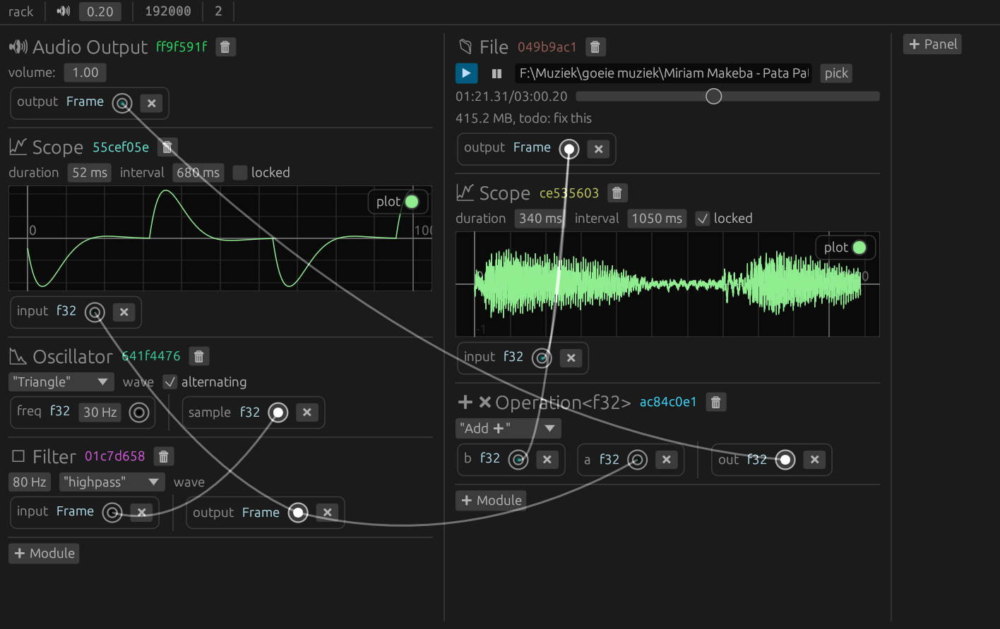

# Rack
A virtual modular synthesizer, written in Rust.

# Concept
I was interested in sound production so I made this.

# Features
At this stage the base has only just been laid and the capabilities are very limited. Some of the available features include:
- Connect together any number of modules.
- Generate all kinds of waves.
- Listen to the waves (native sample rate, mono or stereo).
- Decode and play files (mp3, flac, wav, ogg, etc).
- Plot the waves.
- Math operations.
- Filters.

# Technologies used
- [Rust](https://www.rust-lang.org)
- [egui](https://www.egui.rs)+[eframe](https://github.com/emilk/egui/tree/master/crates/eframe) - ui
- [Symphonia](https://github.com/pdeljanov/Symphonia) - file decoding
- [CPAL](https://github.com/rustaudio/cpal) - audio playback
- [rubato](https://github.com/HEnquist/rubato) - resampling
- [biquad](https://github.com/korken89/biquad-rs) - filters

See [Cargo.toml](Cargo.toml) for more information.

